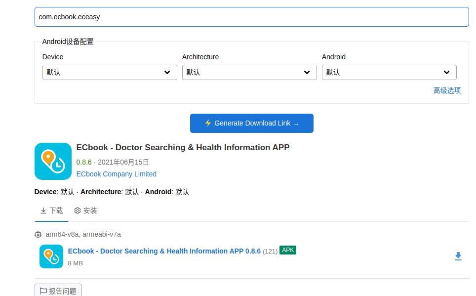
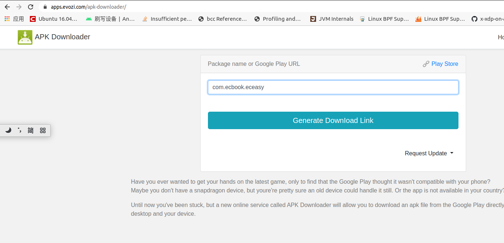

<!--
*** Thanks for checking out the Best-README-Template. If you have a suggestion
*** that would make this better, please fork the repo and create a pull request
*** or simply open an issue with the tag "enhancement".
*** Thanks again! Now go create something AMAZING! :D
-->


<!-- PROJECT SHIELDS -->
<!--
*** I'm using markdown "reference style" links for readability.
*** Reference links are enclosed in brackets [ ] instead of parentheses ( ).
*** See the bottom of this document for the declaration of the reference variables
*** for contributors-url, forks-url, etc. This is an optional, concise syntax you may use.
*** https://www.markdownguide.org/basic-syntax/#reference-style-links
-->
<!-- [![Contributors][contributors-shield]][contributors-url]
[![Forks][forks-shield]][forks-url]
[![Stargazers][stars-shield]][stars-url]
[![Issues][issues-shield]][issues-url]
[![MIT License][license-shield]][license-url]
[![LinkedIn][linkedin-shield]][linkedin-url] -->


<!-- PROJECT LOGO -->
<!-- <br />
<p align="center">
  <a href="https://github.com/othneildrew/Best-README-Template">
    
  </a>

  <h3 align="center">Best-README-Template</h3>

  <p align="center">
    An awesome README template to jumpstart your projects!
    <br />
    <a href="https://github.com/othneildrew/Best-README-Template"><strong>Explore the docs »</strong></a>
    <br />
    <br />
    <a href="https://github.com/othneildrew/Best-README-Template">View Demo</a>
    ·
    <a href="https://github.com/othneildrew/Best-README-Template/issues">Report Bug</a>
    ·
    <a href="https://github.com/othneildrew/Best-README-Template/issues">Request Feature</a>
  </p>
</p>
 -->


<!-- TABLE OF CONTENTS -->
<!-- <details open="open">
  <summary>Table of Contents</summary>
  <ol>
    <li>
      <a href="#about-the-project">About The Project</a>
      <ul>
        <li><a href="#built-with">Built With</a></li>
      </ul>
    </li>
    <li>
      <a href="#getting-started">Getting Started</a>
      <ul>
        <li><a href="#prerequisites">Prerequisites</a></li>
        <li><a href="#installation">Installation</a></li>
      </ul>
    </li>
    <li><a href="#usage">Usage</a></li>
    <li><a href="#roadmap">Roadmap</a></li>
    <li><a href="#contributing">Contributing</a></li>
    <li><a href="#license">License</a></li>
    <li><a href="#contact">Contact</a></li>
    <li><a href="#acknowledgements">Acknowledgements</a></li>
  </ol>
</details> -->


<!-- ABOUT THE PROJECT -->
## APP 下载


### 现有的1000个APP列表
|语法|效果|
|----|-----|
|`[当前1004个app列表](app_list.csv)`|[当前1004个app列表](./app_list.csv)|


### 各地区Google Play热门APP的列表: 持续更新
|语法|效果|
|----|-----|
|`[各地区Google Play热门APP的列表](https://github.com/james-atkins/app-rankings)`|[各地区Google Play热门APP的列表](https://github.com/james-atkins/app-rankings)|

### 其它获取APK的网站
|语法|效果|
|----|-----|-----|
|1|`[apkmonk](https://www.apkmonk.com/)`|[网站1](https://www.apkmonk.com/)|
|2|`[apk-dl](https://apk-dl.com/)`|[网站2](https://apk-dl.com/)|
|3|`[apkcombo](https://apkcombo.com/zh/)`|[网站3](https://apkcombo.com/zh/)|
|4|`[aptoide](https://en.aptoide.com/)`|[网站4](https://en.aptoide.com/)|
|5|`[apk4fun](https://www.apk4fun.com/top/)`|[网站5](https://www.apk4fun.com/top/)|
|6|`[apkhere](https://www.apkhere.com/apk)`|[网站6](https://www.apkhere.com/apk)|

### 根据包名下载APK

|#|语法|效果|
|---|----|-----|
|1|`[apkcombo](https://apkcombo.com/zh/apk-downloader/)`|[网站1](https://apkcombo.com/zh/apk-downloader/)|
|2|`[evozi](https://apps.evozi.com/apk-downloader/)`|[网站2](https://apps.evozi.com/apk-downloader/)|

### 根据包名下载APK
|#|语法|效果|
|---|---|----
|1|`[google play获得APK的包名]`|
|2|`apkcombo下载`|
|3|`evozi下载`|

<!-- GETTING STARTED -->
## 获得APP list中所有APP的类型（新闻类，健身类......）

1. 在当前项目目录安装puppeteer
  ```sh
   npm i puppeteer
   ```
2. 修改app.py中app list的路径
3. 运行app.py
   ```sh
   python3 app.py
   ```


